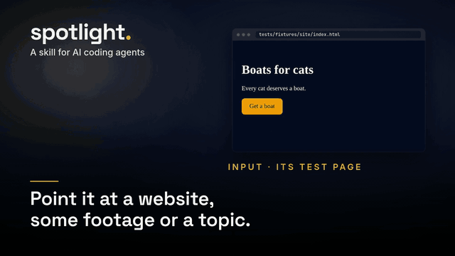

# spotlight

Point your AI agent at a website, some footage or a topic, and get back a finished short video.

[](examples/demo/video.mp4)

*spotlight made this video about itself, using only what's in this repo. [Watch it with sound](examples/demo/video.mp4).*
[](https://aiagentslisting.com/mcp/spotlight)
spotlight is a skill for AI coding agents. You give it whatever you have: a URL, a folder of phone videos and photos, a code project, a spreadsheet, or a sentence about what you want. The agent works out the story, picks the shots and writes the on-screen text in your language (Persian, Arabic and other right-to-left scripts included). Then it cuts to the music, renders, measures the result, and has a second agent critique it before you see it.

There are three modes:

| Mode | You give it | You get |
|---|---|---|
| **brag** | a code project or a website | a 15 to 25 s launch video built from the real product |
| **promo** | footage and photos, plus a line about the offer | a 15 to 30 s promo where your own material is the star |
| **explain** | a topic, some data, maybe a site or footage | a 60 to 180 s explainer, which is a presentation as a video |

## Examples

### A launch video for something you shipped

Run it inside the project, or give it the live site:

```text
/spotlight .
/spotlight https://your-app.com --tone yc-parody
```

It reads the code or captures the site, finds the two or three moments where the product does its job, and builds the video from your real UI, copy and colours. Besides `yc-parody` there are tones like `polished`, `cinematic`, `deadpan` and `chaotic`.

### A promo from a folder of event clips

```text
/spotlight ~/Videos/opening-night "Grand opening Friday at 7. First coffee is on us."
```

It sorts the clips, drops the shaky and dark ones, opens on the strongest moving shot, puts your words on screen and ends on the offer. With `--lang fa` (or `ar`, `de`, `ja` and so on) the text comes out in that language, and Persian or Arabic letters stay joined and run right to left.

### An explainer with real numbers

```text
/spotlight "why we moved support to async" tickets.csv --mode explain
```

This gives you a 90-second landscape video: a hook question, three to five sections that each make one claim and show the evidence, then a takeaway. Every number on screen comes from your CSV, and `sources.md` says where each line of text came from.

### Your footage, the brand's own words

```text
/spotlight https://bakery.example ~/Pictures/bakery
```

It captures the site's copy, colours, fonts and logo, then cuts your photos and clips around them.

### The same video in another format

Ask for it ("make it square for Instagram") or pass `--format landscape`. It reuses the work folder, so it re-renders instead of starting over.

## What you get

A `spotlight-output/` folder, timestamped if one already exists:

- `video.mp4`: H.264 at 30 fps and -14 LUFS, vertical 1080x1920 unless you ask for landscape or square, with the poster embedded as cover art
- `poster.jpg`: the strongest settled frame
- `caption.txt`: a caption ready to post, in the video's language
- `plan.md`: the angle, the shot list and the music cues
- `sources.md`: every line of on-screen text and every number, next to where it came from
- `work/`: everything needed for a re-cut

## How it works

The agent handles the creative side. It writes a brief and a shot plan, then builds the video as a web page where every frame is a function of time, and Chromium captures it frame by frame. A few scripts take care of the fiddly parts:

- `footage.py` turns any photo or clip into upright, sRGB, frame-exact material. It copes with HEIC, HDR, rotated phone video and odd frame rates, encodes the final video, and checks it for frozen stretches, loudness, true peak and frame count. The check also writes a contact sheet with timestamps.
- `site.mjs` captures a website's copy, colours, fonts, logo, screens and a full-page image. It has a hard time limit, so endless feeds and stalled servers can't hang the run.
- `capture.mjs` renders frames in parallel, and the result matches a single-threaded render pixel for pixel.

After the render, a fresh agent that didn't build the video looks through its frames and measurements and writes down what's wrong. The builder fixes those things, and another fresh agent confirms the fixes. This goes on for up to three rounds.

## Install

For Claude Code:

```bash
claude plugin marketplace add AmirSbss/spotlight
claude plugin install spotlight@spotlight
```

For any agent that reads `SKILL.md`, the [skills CLI](https://github.com/vercel-labs/skills) works:

```bash
npx skills add https://github.com/AmirSbss/spotlight --skill spotlight
```

You can also copy `skills/spotlight/` into your agent's skills folder; [docs/other-agents.md](docs/other-agents.md) explains how. It has been tested end to end on Claude Code, Codex CLI and Hermes Agent.

Then check that the machine has what it needs:

```bash
bash skills/spotlight/scripts/doctor.sh
```

You need ffmpeg 4.4 or newer with the zscale filter, ImageMagick 6 or 7, Python 3.8+, Node 18+, and Chromium or Chrome. `uv` is optional and lets spotlight read a music track's tempo and beats. [gpt-image-bridge](https://github.com/oakplank/gpt-image-bridge) is optional too, for the odd AI illustration.

## Ground rules

- Every piece of text, price, number and claim in the video comes from something you gave it. AI images appear only as clearly illustrative backgrounds, and the caption says so.
- Your footage, renders and plans stay on your machine. The one exception is the prompt for an optional AI image, and `--no-ai` turns that off too.
- A video ships only after it passes its own checks: nothing sits still for more than 0.6 s except the end card, the first frame is a finished picture, the call to action stays readable for at least 1.5 s, and the audio sits at -14 LUFS.

## Status

Phase 1 of 4 is done. That covers the three modes, website capture, the check and the critic loop. Phase 2 adds a CC0 music and sound-effects library and optional narration; until then, bring your own music track. Phase 3 brings charts, diagrams and 3D scenes, and phase 4 more demos. The design and the plans live in [docs/superpowers](docs/superpowers).

## Tests

```bash
python3 tests/test_footage.py && python3 tests/test_check.py && python3 tests/test_docs.py
uv run --project skills/spotlight/scripts python tests/test_mix.py
bash tests/test_capture.sh && bash tests/test_kit.sh && bash tests/test_site.sh
bash tests/test_doctor.sh && bash tests/test_bridge_image.sh
```

## Credits

spotlight is built on [brag](https://github.com/latent-spaces/brag) (MIT). The critic loop and quality bar are adapted from [motion-video-kit](https://github.com/echris6/motion-video-kit) (MIT), and the demo's music is CC0. [NOTICE.md](NOTICE.md) lists all of it. spotlight is MIT-licensed.
